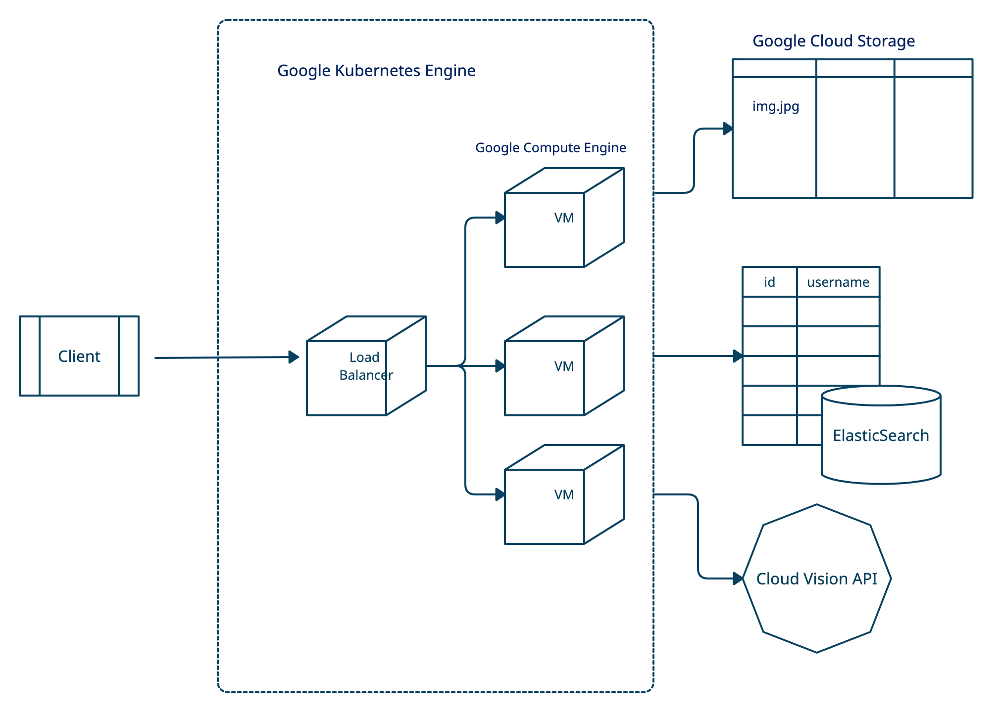

# TL;DR
This is a web service written in Go that provides geo-location based search and facial recognition functionality. It provides three main APIs: ```post```, ```search``` and ```cluster```. 
- Post: Users can submit a post with a message, geolocation and media file.
- Search: Allows users to search nearby posts based on geo-location.
- Cluster: Allows users to find all posts whose media file is an image of face. 

## Behind the Scenes
The service is built with a variety of products and tools provided by Google Cloud Platform. 

- An instance of VM is created via Google Compute Engine (GCE) to write the program. 
- ElasticSearch is used a NoSQL database to store data posted by users. ElasticSearch provides powerful geo-location k-dimensional range search functionality based on a k-d tree.  
- Google Cloud Storage (GCS) is used as a file system to store all media files posted by users. A reference to the file is then stored as metadata in ElasticSearch. 
- Cloud Vision API is an industry-leading engine for image understanding and detecting faces.
- The service is deployed on Google Kubernetes Engine (GKE) to increase reliability of service. GKE runs the service in a cluster with multiple virtual machines. 

The service also implements token-based authentication with JSON Web Token (JWT). Compared with session-based authentication, token-based authentication removes the need for the back-end to store session data. As the token contains all data required to check its validity, no database lookup is needed. 

Go language is the server language for next-generation. It achieves superior efficiency while also being developer-friendly. For example, it decodes JSON object into a Go object (and vice versa) within a single line of code. Go routine, Go's lightweight concurrency mechanism allows growable stacks and easy scheduling by the language construct e.g. time.Sleep, while supporting multiple concurrency synchronization techniques. 
